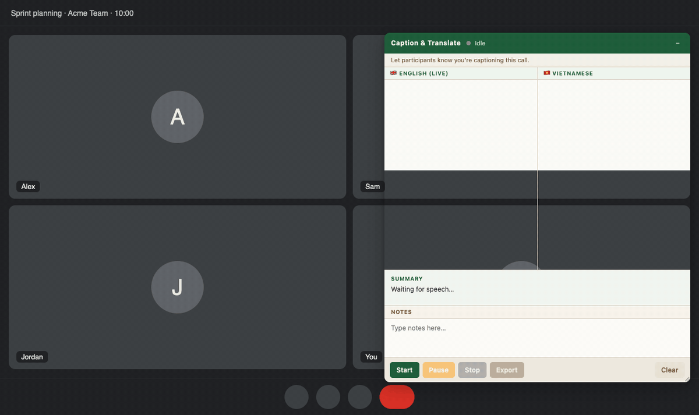
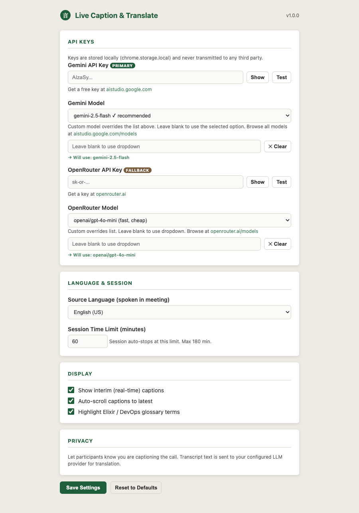

# Live Caption & Translate

A Chrome extension that captions video calls in real time and translates them into Vietnamese.

<p align="center"></p>

<p align="center"><sub>Mock call with fictional participants and sample sentences, to show the overlay.</sub></p>

## Why

Meetings, client calls and webinars often happen in a language you only half follow. This extension puts live English captions and a Vietnamese translation in an overlay on the call page, so you can keep up without pausing the conversation.

## Features

- Live captions using the browser's Web Speech API (microphone input)
- Vietnamese translation of each finished segment
- Short Vietnamese summary and keywords for longer segments
- Glossary highlighting for Elixir/OTP and DevOps terms
- Notes panel
- Tab audio recording, and export of the session as JSON, TXT or WebM
- Clear session: stops and clears in-memory captions and notes

Works on Google Meet, Zoom, Microsoft Teams, Webex, Whereby, Amazon Chime and Skype web pages.

## Install

1. Run `python3 create_icons.py` to generate the icons in `assets/` (standard library only). Pre-built icons are already included.
2. Open `chrome://extensions` and turn on Developer mode.
3. Click Load unpacked and select this folder.

## Screenshots

<p align="center"></p>

The options page: bring your own Gemini or OpenRouter key, pick the spoken language and set a session limit.

## Configuration

Open the extension's Options page and enter:

- A Gemini API key (primary provider; default model `gemini-2.5-flash`). Keys are available from Google AI Studio.
- Optionally an OpenRouter API key, used as a fallback if Gemini fails or no Gemini key is set (default model `openai/gpt-4o-mini`).

Both model names can be changed. Use the Test button, then Save Settings.

Shortcuts: `Ctrl/Cmd+Shift+L` start or stop, `Ctrl/Cmd+Shift+P` pause or resume, `Ctrl/Cmd+Shift+X` clear session.

## Privacy

- API keys are stored in `chrome.storage.local` and only sent to the provider they belong to.
- Speech recognition uses the Web Speech API, which in Chrome sends audio to Google's speech service.
- Transcript text is sent to Gemini or OpenRouter (whichever you configured) for translation, and summaries.
- Recorded tab audio stays in memory and is only saved to disk when you export it.
- The extension runs only on the supported call sites listed in `manifest.json`.
- Tell participants that you are captioning or recording the call.

## Project structure

```
manifest.json      MV3 manifest
background.js      Service worker: session state, LLM calls, offscreen document
offscreen.html/js  Tab audio capture with MediaRecorder
glossary.js        Technical term definitions
content/           Overlay UI (overlay.js, overlay.css)
options.*          Settings page
popup.*            Toolbar popup
create_icons.py    Icon generator
docs/product-spec.md
```

## License

MIT, see [LICENSE](LICENSE).
